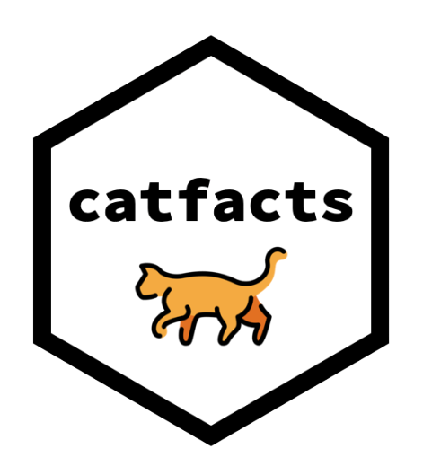

<!-- README.md is generated from README.Rmd. Please edit that file -->

# catfacts 

<!-- badges: start -->

[](https://github.com/tyluRp/catfacts/actions)
<!-- badges: end -->

The goal of catfacts is to demonstrate an opinionated approach to
structuring a shiny app. Primary motivation for catfacts is to avoid
mistakes I have made in the past while developing. Key topics are:

  - [Structure](#structure)
  - [Organizing data](#organizing-data)
  - [Documenting dependencies](#documenting-dependencies)
  - [Testing with `testthat`](#testing-with-testthat)
  - [Testing utilities](#testing-utilities)
  - [Continuous integration](#continuous-integration)

## Structure

    .
    ├── R
    │   ├── ui_dashboard_body.R
    │   ├── ui_dashboard_header.R
    │   ├── ui_dashboard_sidebar.R
    │   ├── ui_tabs.R
    │   └── utils.R
    ├── README.Rmd
    ├── README.md
    ├── catfacts.Rproj
    ├── data
    │   ├── README.md
    │   └── contact.rds
    ├── data-raw
    │   ├── README.md
    │   └── contact.R
    ├── global.R
    ├── inst
    │   └── extdata
    │       ├── README.md
    │       └── contact.csv
    ├── renv
    │   ├── activate.R
    │   ├── library
    │   │   └── R-4.0
    │   ├── settings.dcf
    │   └── staging
    ├── renv.lock
    ├── server.R
    ├── tests
    │   ├── testthat
    │   │   ├── test-cat-fact.R
    │   │   └── test-contact.R
    │   └── testthat.R
    ├── ui.R
    └── www
        ├── custom.css
        └── logo.png

  - `R`: Contains all R code to be used in the application. Typically
    contains functions and UI components. When making UI functions,
    prefix them with `ui_`.
  - `README.Rmd`: A readme file generated by RMarkdown. Use this to
    explain the intent of the app.
  - `data`: Store all static data here. Use `.rds` and name everything
    in all lowercase.
  - `data-raw`: Store scripts used to generate objects in `data` here.
  - `global.R`: Store code to “initilize” your app here. This file will
    run once before the app starts.
  - `inst/extdata`: Store all external data here.
  - `renv`: Controll and document the apps dependencies. See the `renv`
    project for more information.
  - `server.R`: Store all server side code here.
  - `tests/testthat`: Store all tests here.
  - `ui.R`: Store user interface stuff here, though try to keep it small
    if possible by storing `ui_` functions in `R`. Try to think of
    individual components of the UI and save them as a function.
  - `www`: Additional assets, mostly custom CSS files.

**Note:** There are some other notable files missing from the tree
diagram, these are:

  - `.Rprofile`: Code stored here will be available on a fresh R
    session. I use this for the testing utilities and `renv`.
  - `.github/workflows/build.yml`: A workflow for continually testing
    the shiny app with each push or pull request.

## Organizing data

  - **Problem:** I have a vector of 10 choices and that vector is
    copied/pasted throughout the app and the apps tests. Any changes to
    that dropdowns choices will require numerous, redundant changes.

  - **Resolution:** Consider any static, reusable data and document it’s
    creation in `data-raw`, save it in `data`. If the data comes from an
    external source, store the original in `inst/extdata`, document any
    manipulation in `data-raw` and save it in `data`. Reuse that data
    throughout the app and the apps tests.

## Documenting dependencies

  - **Problem:** I just updated a package to use a development version
    which in turn broke a different app that depended on the CRAN
    version.

  - **Solution:** Use `renv` to control project specific dependencies.

Note: I have never actually run into the problem I described but the
thought of project specific dependencies makes me happy and less nervous
about things breaking.

## Testing with `testthat`

  - **Problem:** My data is dynamic and I want my tests to introduce
    randomness when possible, the snapshot approach using `shinytest`
    will not work.

  - **Solution:** Use `shinytest` for automating the app operations and
    `testthat` for testing the apps output.

Note: `shinytest` does have a solution for handling dynamic data which
is to use dummy data while in test mode, see
[here](https://rstudio.github.io/shinytest/articles/in-depth.html#dealing-with-dynamic-data).
However, to my knowledge `shinytest` cannot introduce randomness by
design, only control it, see
[here](https://rstudio.github.io/shinytest/articles/in-depth.html#controlling-randomness).

For my particular use case, a user can generate many different outputs
by selecting values from numerous dropdowns. My main concern is that
regardless of what they pick, the output makes sense. As a result, I
prefer a set of tests that randomly pick certain values from dropdowns
and compare the actual result to the expected result with `expect_`
functions from `testthat`.

If you decide to write tests that introduce randomness, make sure you
have a method of retrieving the random inputs that cause a test to fail.
I have use `assign()` to assign random inputs to the global environment.

## Testing utilities

Some utility functions for testing are provided in the `.Rprofile`. Note
that these will always available on a fresh R session.

  - `test_app()` runs all tests found in `tests/testthat`
  - `test_menu()` runs only the tests you pick from an interactive menu
    in the console
  - `test_report()` writes the test results to a csv in the root
    directory of the project

## Continuous integration

A workflow for running all tests with each push or pull request is
provided in
[`.github/workflows/build.yaml`](.github/workflows/build.yaml). This
runs all the tests and triggers a “pass” if all tests pass or a “fail”
if any of the tests fail, this is done by running:

``` r
testthat::test_dir("tests/testthat", stop_on_failure = TRUE)
```
